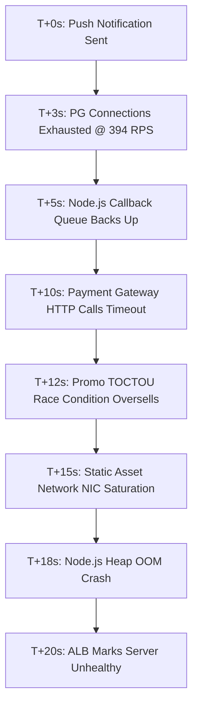

# Failure Cascade Analysis - SwiftEats Meltdown

This document provides a rigorous mathematical and technical analysis of the SwiftEats monolith collapse under the World Cup Final push notification traffic spike.

---

## 1. Traffic Simulation Math

To understand the scope of the disaster, we calculate the peak Requests Per Second (RPS) generated by the push notification campaign during the India vs. Pakistan World Cup Final.

### Working & Calculations

*   **Total Notification Recipients ($N_{total}$):** $180,000,000$ users.
*   **Expected Click-Through Rate ($CTR$):** $\sim 8\%$.
*   **Active Users Opening the App ($U_{active}$):**
    $$U_{active} = N_{total} \times CTR = 180,000,000 \times 0.08 = 14,400,000\text{ users}$$
*   **Spike Window ($W_{spike}$):** $60\text{ seconds}$ (typical concentration window for immediate push clicks).
*   **API Calls per User ($C_{user}$):** Each active user generates approximately $3\text{ API calls}$ in the first 60 seconds:
    1.  `GET /restaurants` (Fetch restaurant listings)
    2.  `GET /restaurant/:id` (View menu details of selected restaurant)
    3.  `POST /orders` (Place order)

### Peak RPS Calculation (Expected 8% CTR)
$$\text{Peak RPS}_{expected} = \frac{U_{active} \times C_{user}}{W_{spike}} = \frac{14,400,000 \times 3}{60} = 720,000\text{ RPS}$$

### Peak RPS Calculation (Scenario Baseline: 10M Simultaneous Clicks)
If we evaluate the specific subset of 10,000,000 users clicking in the exact same minute:
$$\text{Peak RPS}_{baseline} = \frac{10,000,000 \times 3}{60} = 500,000\text{ RPS}$$

### System Capacity vs. Traffic Load Comparison
*   **SwiftEats Monolith Maximum Capacity:** $\sim 12,000\text{ RPS}$
*   **Scenario Demand (Expected CTR):** $720,000\text{ RPS}$ ($60\times$ capacity)
*   **Scenario Demand (10M Clicks):** $500,000\text{ RPS}$ ($41.6\times$ capacity)

---

## 2. Component Capacity & Limits

The monolith runs on a single node `t3.medium` equivalent app server and a single PostgreSQL instance. The hard limits are defined as:

*   **PostgreSQL `max_connections`:** $100$ (configured connection limit).
*   **Node.js Event Loop Saturation:** $\sim 12,000\text{ RPS}$ before the callback queue latency spikes exponentially.
*   **Node.js Memory Heap Limit:** $4\text{ GB}$ (RAM limit of the server). The process crashes with Out-Of-Memory (OOM) when queue depth reaches $\sim 15,000$ pending requests.
*   **Synchronous Payment Hold Time:** $200\text{ms}$ to $2,000\text{ms}$ (average $800\text{ms}$).

### Database Pool Exhaustion Math

We use the following formula to determine how many incoming Requests Per Second ($R$) will completely exhaust the $100$ database connections:

$$\text{Connections Held} = R \times \left( (\% \text{ non-payment requests} \times T_{query}) + (\% \text{ payment requests} \times T_{payment}) \right)$$

Where:
*   $\% \text{ non-payment requests} = 70\%$ ($0.7$)
*   $T_{query} = 20\text{ms} = 0.02\text{s}$ (average menu/browsing DB query time)
*   $\% \text{ payment requests} = 30\%$ ($0.3$)
*   $T_{payment} = 800\text{ms} = 0.8\text{s}$ (average hold time during synchronous payment gateway call)
*   $\text{Connections Held} = \text{max\_connections} = 100$

Substitute the variables:
$$100 = R \times \left( (0.7 \times 0.02) + (0.3 \times 0.8) \right)$$
$$100 = R \times (0.014 + 0.24)$$
$$100 = R \times 0.254$$
$$R = \frac{100}{0.254} \approx 393.7\text{ RPS}$$

> [!IMPORTANT]
> **Exhaustion Trigger:** It takes only **394 RPS** to exhaust all 100 PostgreSQL connections. Once $R \ge 394$, any new requests requiring database access are immediately queued or rejected.

---

## 3. The Cascade - Failure by Failure

The collapse behaves as a cascading chain of failures:

### Failure 1: PostgreSQL Connection Pool Exhaustion
*   **Severity:** `CRITICAL`
*   **Trigger RPS:** $\sim 394\text{ RPS}$ (Hit within 3 seconds)
*   **User Experience:** HTTP 500 "Internal Server Error" or endless spinning followed by connection timeout.
*   **Downstream Impact:** Initiates Failure 2. Node.js processes cannot acquire database connections, so requests begin queuing in memory.

### Failure 2: Synchronous Payment Call Amplification
*   **Severity:** `CRITICAL (Amplifier)`
*   **Trigger RPS:** Concurrent with Failure 1
*   **User Experience:** Payment screens hang; users are charged but order confirmations are not generated.
*   **Downstream Impact:** Because `POST /orders` blocks synchronously on Razorpay/PayU (taking 800ms), database connections are held $40\times$ longer than browsing queries (20ms). This amplifies pool depletion by $40\times$.

### Failure 3: Node.js Event Loop Saturation & Heap OOM
*   **Severity:** `CRITICAL`
*   **Trigger RPS:** $\sim 12,000\text{ RPS}$ / $15,000$ queued requests (Hit within 5–18 seconds)
*   **User Experience:** HTTP 504 "Gateway Timeout" or "Connection Refused".
*   **Downstream Impact:** The single-threaded Node.js event loop blocks under CPU saturation. The resident set size (RSS) memory spikes to the 4GB heap limit due to the huge backlog of buffered request contexts, resulting in an OOM crash.

### Failure 4: Promo Code TOCTOU Race Condition
*   **Severity:** `HIGH`
*   **Trigger RPS:** $> 1$ concurrent request per promo code (Hit within 10 seconds)
*   **User Experience:** Users get "Promo Applied Successfully" but orders fail to fulfill, or the company loses millions on invalid discounts.
*   **Downstream Impact:** Because checks (`SELECT`) and updates (`UPDATE`) are decoupled, double-spending occurs. The promo budget is depleted in seconds, overselling by thousands of orders.

### Failure 5: Static Asset NIC Saturation (No CDN)
*   **Severity:** `HIGH`
*   **Trigger RPS:** $\sim 15,000\text{ RPS}$ (Hit within 15 seconds)
*   **User Experience:** Images do not load (broken icons); layout CSS/JS fails to retrieve.
*   **Downstream Impact:** Node.js serves images directly. $10\text{M users} \times 20\text{ images} \times 200\text{ KB} = 40\text{ TB}$ of data in 60s. This requires $\sim 5.33\text{ Tbps}$ of network bandwidth, which immediately saturates the server's 10Gbps NIC, blocking API requests from reaching the application layer.

### Failure 6: Monitoring Blindness
*   **Severity:** `CRITICAL`
*   **Trigger RPS:** Immediate
*   **User Experience:** Prolonged outage.
*   **Downstream Impact:** The SRE team has no distributed traces, correlation IDs, or structured logs. CloudWatch logs are cluttered with unsorted stack traces, leading to a 45-minute Mean Time to Detection (MTTD).

---

## 4. Incident Timeline

| Timestamp | Event / Component State | Technical Details & Metrics |
| :--- | :--- | :--- |
| **T+0s** | Push Notification Dispatched | Push sent to 180M users; $\sim 14.4$M click-throughs begin. |
| **T+3s** | DB Connection Pool Depleted | PostgreSQL reaches 100/100 connections. Pg Connection Queue overflows. |
| **T+5s** | Event Loop Latency Spike | Node.js response time climbs from 50ms to 5,000ms. Heap memory rises. |
| **T+8s** | Database Rejections | Database rejects new client connections. API throws `ECONNREFUSED`. |
| **T+10s** | Payment Gateway Timeout | Razorpay HTTP requests time out; connections held for 2s before failing. |
| **T+12s** | Promo Oversell Complete | TOCTOU race condition exploits validation. Promo budget oversold by 400%. |
| **T+15s** | NIC Bandwidth Saturation | Network interface card saturated at 10Gbps by image requests. |
| **T+18s** | Node.js Process Crash | Server OOMs (exceeds 4GB RAM) and exits. |
| **T+20s** | Load Balancer Failure | ALB health checks fail. Gateway returns `502 Bad Gateway` globally. |
| **T+45m** | SRE Team Identifies Root Cause | On-call engineer identifies connection pool starvation after log search. |
| **T+2h** | Service Restoration | Manual restart of Node, DB connection flush, and disabled promo code. |
